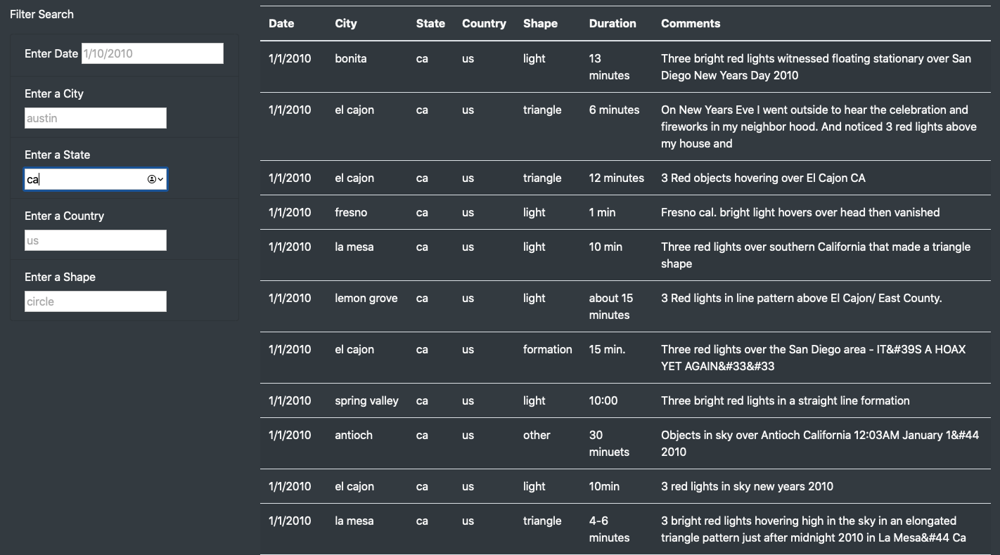
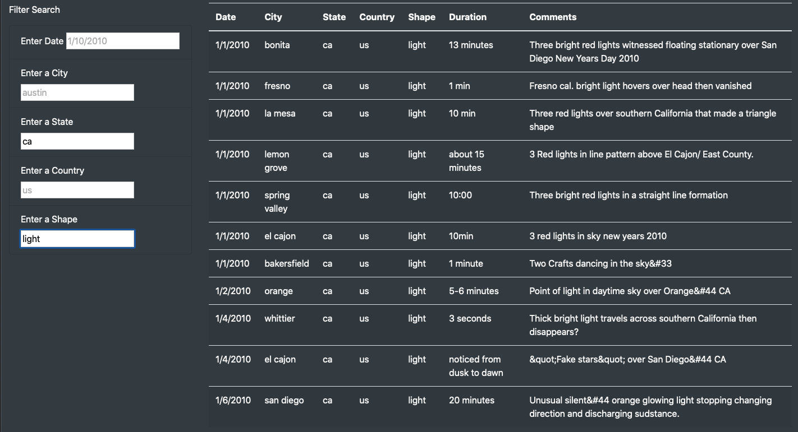
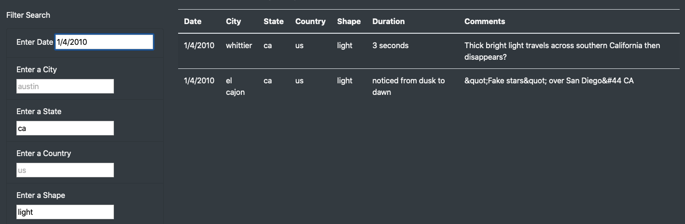

# UFOs

## Purpose of the Analysis
To allow UFOlogists and hobbyists to be able to search through a database of UFO sightings and narrow down the results based on a set of criteria.

## Results
The website operates on a library filter structure where results can be segmented by five (5) different criteria; Date, City, State, Country and Shape. 
Visitors to the webpage can start in any category to start the filtering as shown:

* 

* 

* 

After selecting search field parameters the user presses the 'Enter/Return' key to produce the results.
Clearing the seacrh fields returns all the data to its original state . 

## Summary
This webpage works well with one caveat being that the user doesnt have a selectable index of all the availabe results per field, meaning that unless the user can search for an occurence based on an known availabe value the page will render an empty table . 